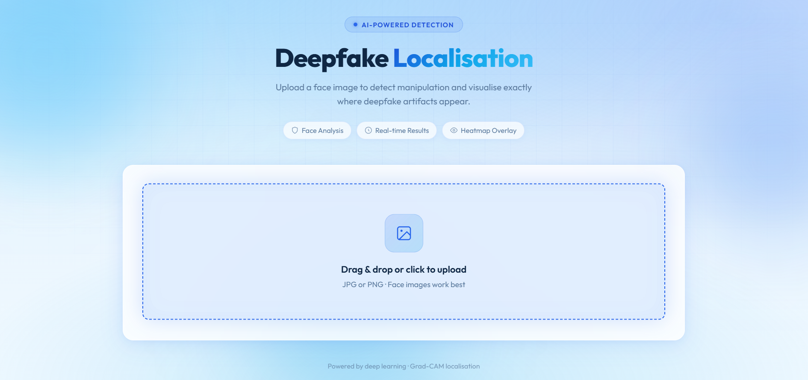

# Deepfake Localisation

An AI-powered system that **detects deepfake face images** and **localises manipulated regions** using an ensemble of EfficientNet-B0 classifiers and EigenCAM explainability. Includes a FastAPI backend and a modern web UI for drag-and-drop analysis.

**Repository:** [github.com/VenushreeLokesh/Deepfake](https://github.com/VenushreeLokesh/Deepfake)


---

## Demo

### Web interface

Upload a face image, run analysis, and view detection results with confidence and localisation scores.



### Analysis output

The system returns a four-panel visualisation: original image, EigenCAM heatmap, binary mask, and localisation overlay.


### Demo walkthrough

1. Start the server: `python -m app.main`
2. Open **http://localhost:8000**
3. Upload a JPG or PNG face image
4. Click **Analyze Image**
5. Review the verdict, confidence, localisation score, and heatmap output

> **Tip:** Add your own screenshots to `docs/images/` as `web-ui.png` and `analysis-output.png` so they render on GitHub.

---

## Features

- **Binary deepfake detection** — classifies face images as Real or Fake
- **Ensemble inference** — combines three trained models for robust predictions
- **Visual localisation** — EigenCAM heatmaps, binary masks, and red overlay on suspected fake regions
- **Localisation score** — quantifies how strongly the model focuses on manipulated areas
- **Web interface** — upload JPG/PNG images and view results in real time
- **Training & evaluation pipeline** — scripts for training, testing, and visualising model outputs

---

## How It Works

```
Upload Image → Preprocess (224×224) → Ensemble Classification → EigenCAM Heatmap
                                              ↓
                              Binary Mask + Morphological Filtering
                                              ↓
                              Red Overlay + 4-Panel Visualisation
```

1. **Classification** — Three EfficientNet-B0 models predict fake probability; the ensemble uses the **maximum** fake score across models.
2. **Localisation** — EigenCAM (on the Celeb-DF model) highlights regions that influenced the prediction.
3. **Segmentation** — The heatmap is thresholded, cleaned with morphological operations, and constrained to a central face ellipse.
4. **Output** — A four-panel image shows: Original | Heatmap | Binary Mask | Localisation Overlay.

---

## Tech Stack

| Component | Technology |
|-----------|------------|
| Deep learning | PyTorch, torchvision (EfficientNet-B0) |
| Explainability | pytorch-grad-cam (EigenCAM) |
| Image processing | OpenCV, Pillow, NumPy |
| Backend API | FastAPI, Uvicorn |
| Frontend | HTML5, CSS, Vanilla JavaScript |
| Evaluation | scikit-learn, Matplotlib |

---

## Project Structure

```
deepfake-localisation/
├── app/
│   ├── main.py              # FastAPI server & routes
│   ├── inference.py         # Ensemble inference + localisation pipeline
│   └── static/
│       └── index.html       # Web UI
├── models/
│   ├── classifier.py        # Dataset & EfficientNet-B0 model definition
│   ├── train.py             # Training script
│   ├── evaluate.py          # Test evaluation & confusion matrix
│   ├── gradcam.py           # EigenCAM utilities
│   └── segmentation.py      # Mask generation & overlay
├── visualise.py             # Standalone visualisation helper
├── scrape_tpdne.py          # Download GAN faces for fine-tuning
├── requirements.txt
└── README.md
```

---

## Models

The inference pipeline loads three model checkpoints from the `models/` directory:

| File | Purpose | Notes |
|------|---------|-------|
| `deepfake_classifier.pth` | GAN-generated faces | Trained on 140k Real and Fake Faces (~96% val accuracy) |
| `deepfake_classifier_finetuned.pth` | Fine-tuned GAN detector | Fine-tuned on ThisPersonDoesNotExist images |
| `deepfake_celebdf.pth` | Video face-swap deepfakes | Trained on Celeb-DF (~90% accuracy); used for localisation |

> **Note:** Model weight files (`.pth`) are not included in this repository due to size. Place your trained weights in the `models/` folder before running inference, or train them using the scripts below.

---

## Datasets

| Dataset | Use |
|---------|-----|
| [140k Real and Fake Faces](https://www.kaggle.com/datasets/xhlulu/140k-real-and-fake-faces) | Primary GAN classifier training |
| Celeb-DF | Video deepfake / face-swap detection model |
| [ThisPersonDoesNotExist.com](https://thispersondoesnotexist.com) | Optional fine-tuning data (via `scrape_tpdne.py`) |

---

## Installation

### Prerequisites

- Python 3.9+
- pip
- (Optional) CUDA-capable GPU for faster inference and training

### Setup

```bash
# Clone the repository
git clone https://github.com/VenushreeLokesh/Deepfake.git
cd Deepfake

# Create and activate a virtual environment
python -m venv venv

# Windows
venv\Scripts\activate

# macOS / Linux
source venv/bin/activate

# Install dependencies
pip install -r requirements.txt
```

### Model weights

Add the following files to the `models/` directory:

```
models/deepfake_classifier.pth
models/deepfake_classifier_finetuned.pth
models/deepfake_celebdf.pth
```

---

## Usage

### Run the web application

From the project root (`deepfake-localisation/`):

```bash
python -m app.main
```

Open your browser at **http://localhost:8000**

- Drag and drop or click to upload a face image (JPG/PNG)
- Click **Analyze Image**
- View the verdict (Authentic / Deepfake Detected), confidence, localisation score, and visual output

### API endpoint

**POST** `/predict`

- **Input:** `multipart/form-data` with an image file
- **Output:** JSON

```json
{
  "label": "Fake",
  "confidence": 87.5,
  "localisation_score": 72.3,
  "weak_localisation": false,
  "result_image": "<base64-encoded PNG>"
}
```

### Train the GAN classifier

Update dataset paths in `models/train.py` if not using Kaggle, then:

```bash
cd models
python train.py
```

The trained weights are saved to `models/deepfake_classifier.pth`.

### Evaluate on test set

```bash
cd models
python evaluate.py
```

Outputs are saved to `outputs/` (confusion matrix, prediction samples).

### Download fine-tuning images (optional)

```bash
pip install requests
python scrape_tpdne.py --count 300 --out data/tpdne_fakes
```

---

## Inference Details

- **Input size:** 224 × 224 RGB
- **Ensemble strategy:** `max(fake_probability)` across all three models
- **Prediction threshold:** 0.5 (fake if max fake prob ≥ 0.5)
- **CAM method:** EigenCAM on `celeb_model.features[-3]`
- **Mask threshold:** 0.6 (heatmap values above this become part of the binary mask)
- **Weak localisation:** If no mask pixels remain after filtering, a fallback elliptical face region is used

---

## Limitations

- Optimised for **single face images**, not full videos
- Performance depends on image quality, lighting, and how similar the fake is to the training distribution
- Localisation is an **explanatory approximation**, not ground-truth pixel-level forgery segmentation
- Model weights must be obtained separately (train locally or add your own checkpoints)

---

## Author

**Venushree L**  
GitHub: [@VenushreeLokesh](https://github.com/VenushreeLokesh)

---

## License

This project is licensed under the **MIT License** — see the [LICENSE](LICENSE) file for details.
